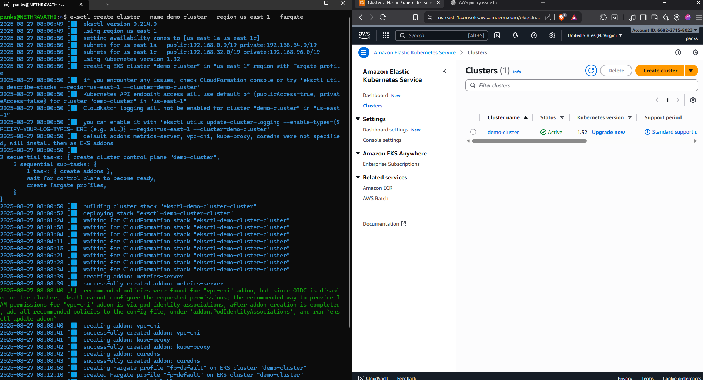
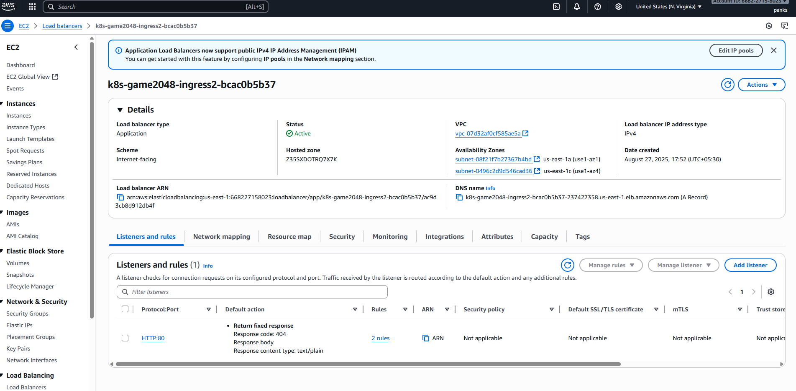

#AWS EKS PROJECT

## Steps to Deploy:

1.Prerequisities.

2.Create a eks-cluster:
  	- Cluster can be created in 2 ways using AWS-UI and AWS-CLI.
  	- I went with cli:
        	- "eksctl create cluster --name demo-cluster --region us-east-1 --fargate"
        	- It creates: 
        	 	VPC with both public and private subnets across multiple AZs.
        	        NAT Gateway for outbound internet from private subnets
        		EKS control plane (managed by AWS)
        		CloudFormation stacks handling the infrastructure
        		IAM roles:
            			Cluster control plane IAM role
            			Fargate pod execution role
        		Fargate profile – default selectors for key namespaces
        		Essential Kubernetes add-ons installed by default
		  
	
    
	
NOTE: OpenID connect provider URL: eksctl creates a IAM role whose policy is to trust tokens from EKS cluster OIDC provider. Pods gets an OIDC token from EKS cluster OIDC provider. AWS IAM checks trust policy, if checks pass - pod assumes the IAM role and gets temporary AWS credentials.

3.This command writes the cluster’s connection info + authentication method into your kubeconfig, so that kubectl knows how to securely connect to your EKS cluster.
  	- "aws eks update-kubeconfig --name demo-cluster --region us-east-1"

4.This command creates fargate profile alb-sample-app and tells to run on namespace game-2048(does not create namespace), any pod deployed in namespace game-2048 will run on fargate.
  	- "eksctl create fargateprofile --cluster demo-cluster --region us-east-1 --name alb-sample-app --namespace game-2048"

5.App Deployment:This command fetches image from aws eks:
  	- "kubectl apply -f https://raw.githubusercontent.com/kubernetes-sigs/aws-load-balancer-controller/v2.5.4/docs/examples/2048/2048_full.yaml"
  	- It creates resources:
   		Namespace → isolate the app.
   		Deployment → run 5 replicas of the game.
  	 	Service → expose the pods internally.
   		Ingress + ALB Controller → create a public ALB in AWS to expose the game to the internet.

6.Creating AWS Ingress controller(pod):
  	- First Giving access to pod to access aws services like alb.
  	- Download- Already ready-made policy: 
		- "curl -O https://raw.githubusercontent.com/kubernetes-sigs/aws-load-balancer-controller/v2.11.0/docs/install/iam_policy.json".
  	- Create policy:
		- "aws iam create-policy --policy-name AWSLoadBalancerControllerIAMPolicy --policy-document file://iam_policy.json".
        - Creating service account and attaching IAM Role:
		- "eksctl create iamserviceaccount --cluster=<your-cluster-name> --namespace=kube-system --name=aws-load-balancer-controller --role-name AmazonEKSLoadBalancerControllerRole
                   --attach-policy-arn=arn:aws:iam::<your-aws-account-id>:policy/AWSLoadBalancerControllerIAMPolicy --approve".
  	- Creating ALB controller using helm chart which will create ALB using service account:
  		- Add heml repo:
			- "helm repo add eks https://aws.github.io/eks-charts".
		- Update helm repo:
			- "helm repo update eks".
                - Install the controller:(GET VPC ID FROM EKS CLUSTER->NETWORKING)
			- "helm install aws-load-balancer-controller eks/aws-load-balancer-controller -n kube-system \
  			   --set clusterName=<your-cluster-name> \
 		           --set serviceAccount.create=false \
  			   --set serviceAccount.name=aws-load-balancer-controller \
  			   --set region=<your-region> \
  			   --set vpcId=<your-vpc-id>".
                - Check if load balancer controller is created and its replicas:
			- "kubectl get deployment -n kube-system aws-load-balancer-controller".
                - Check if alb is is created or not in EC2 DASHBOARD->LB.
                - Go to LB>DNS name>copy paste in browser url.
